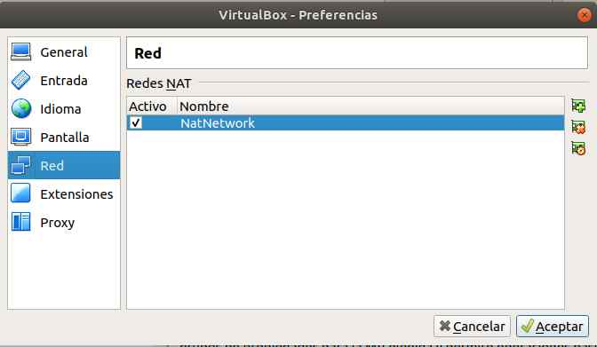
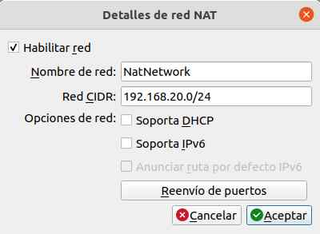
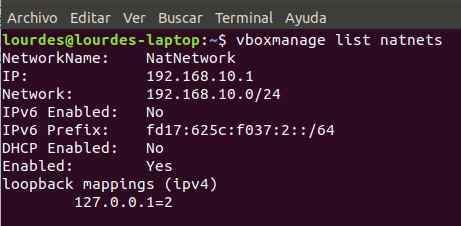

### Tarea 1. Crea las siguientes máquinas virtuales (en esta asignatura nunca recomiendo últimas versiones de los S.O)
• Un Windows Server con el nombre ServW  
• Ubuntu 22.04 o superior sin escritorio gráfico con el nombre ServLinux  
• Ubuntu 22.04 o superior (Desktop) con el nombre CliLinux  
• Un cliente Windows con el nombre Cliw  

Recuerda que estas máquinas sólo deberías utilizarlas en el módulo de Servicios en Red para no tener problemas con las instalaciones que hagas en otros módulos.   

**Los sistemas operativos Windows los puedes descargar de dos sitios:**
1. Si ya tienes tu usuario y contraseña de Microsoft 365 en el primer tema tienes un manual de descarga de SW desde Microsoft 365  
Como sabes sólo tenemos una licencia por sistema operativo de windows, así que para trabajar todo el curso te recomiendo que instales el S.O pero no lo actives
2. Desde este enlace puedes descargar iso de evaluación, tienes 90 días para utilizar estas iso,  
https://www.microsoft.com/es-es/evalcenter/

el procedimiento será el siguiente:  
• descargas la iso  
• creas la máquina virtual  
• generas una ova con la máquina recien instalada y te la guardas  

cada vez que necesites un máquina nueva porque te ha vencido la licencia o porque está corrupta recurres a la ova generada y te creas una máquina nueva a partir de ésta  

**Ubuntu de la página**  
www.ubuntu.com.  
El uso de los S.O de windows dependerá de los recursos de vuestra máquina física.  

Os recomiendo que una vez creadas las máquinas y ANTES DE EMPEZAR A TRABAJAR CON ELLAS las exporteis y guardéis una copia virgen que os será útil cada vez que se os rompa una máquina.

### Tarea 2. Asegurate de entender bien los modos de configuración de red de la herramienta de virtualización.
NOTA:
Durante este curso vamos a instalar servicios de red, necesitaremos siempre un servidor donde instalamos el servicio y un cliente que hará uso del mismo. Para realizar un escenario de pruebas existen varias posibilidades:  

• Hacer una red servidor-cliente interna a la herramienta de virtualización que no se comunica con la red externa (la red de casa)  

• Hacer una red servidor-cliente interna a la herramienta de virtualización y configurar el servidor con dos tarjetas de red para que enrute hacia la red externa.  

• Hacer una red servidor-cliente interna a la herramienta de virtualización y configurar otro equipo que realice el enrutamiento.  

• Utilizar el equipo anfitrión como el cliente del servicio ubicado en la máquina huesped que tiene el servidor. Con el modo puente podríamos conseguir esto pero estaríamos en la misma red de casa y se podrían generar conflictos entre
los servidores que instalemos en las prácticas y los servidores que posee nuestra  red.  Por  ej  cuando  instalemos  un  S.DHCP es  muy  probable  que
vuestro router de casa también sea S.DHCP .  

Resumiendo, podemos montar diferentes escenarios, cada uno tiene unas ventajas y unos inconvenientes. Lo importante de esta tarea es que tengáis muy claro cómo se van a comportar las máquinas dependiendo del adaptador que uséis, así durante el curso podréis ir modificando según vuestras necesidades.

### Tarea 3. Crea una red Red NAT en tu VirtualBox y configura su servidor dhcp para que asigne ip’s en la red: 192.168.20.0/24   
Así pues de momento tendremos una red "aislada" con equipos que tendrán ip’s fijas con  un  router  virtual  (router  del  VirtualBox)  que  asignará  ip’s  en  la  red
192.168.20.0/24, que hará natting y que nos permitirá tener salida al exterior.  

Con esta opción, en los temas en los que sea posible utilizaremos una única máquina que hará de servidor y abriremos el puerto correspondiente del router virtual para que de servicio a los clientes.  

RECUERDA:   
Para hacer este punto, abrimos VirtualBox y creamos una red  Red NAT, para ello vamos a archivo-preferencias-red, una vez dentro de red creamos una red pulsando el botón de agregar

 y luego editamos la red poniéndole el nombre y la dirección que deseemos:  

FIJATE HE  DEJADO  DESHABILITADO  EL  SERVIDOR  DHCP  PORQUE  DE MOMENTO NO LO UTILIZAREMOS, es más, no queremos hacerlo porque el primer servicio que instalaremos será un nuestro propio servidor DHCP. 

### Tarea 4. Cambia todos los adaptadores de tus máquinas a modo de red Red NAT.  
  De  esta  forma  tendremos  comunicación  con  el  exterior,  pero independizaremos nuestra red privada de máquinas virtuales de nuestra red de casa para evitarnos conflictos.   

De momento no utilizaremos el servidor dhcp que acabamos de configurar.   

Todas las máquinas tendrán una ip fija que para todos los alumnos será la misma:  

Linux: ServLinux: 192.168.20.5  
Windows Server: ServW : 192.168.20.6  
Linux: CliLinux: 192.168.20.20   
Windows cliente: Cliw : 192.168.20.21  
Máscara de red (común a todas las máquinas): 255.255.255.0  

La puerta de enlace y tu servidor DNS será el router virtual que normalmente tendrá la ip 192.168.20.1.   Compruébalo ejecutando desde la consola de la máquina física:  

**En linux**  
vboxmanage list natnets  

**En windows**  
Te situas en la carpeta virtualBox y ejecutas  
.\VBoxManage list natnets  
este comando te lista la configuración de tus redes RedNat del virtualBox. En la siguiente pantalla tienes un ejemplo de mi configuración, como verás yo tengo la red
192.168.10.0/24 en tu caso debe salirte la red 192.168.20.0/24 que es la que acabas de configurar  

**Para entregar.**  
Envía alguna imágen/es donde se pueda apreciar como se comunican las máquinas virtuales entre si, por ejemplo puedes hacer ping entre ellas, y comprueba que tienes salida a internet desde todas las máquinas, si no es así no continúes con las tareas hasta que el escenario funcione y sea estable.
