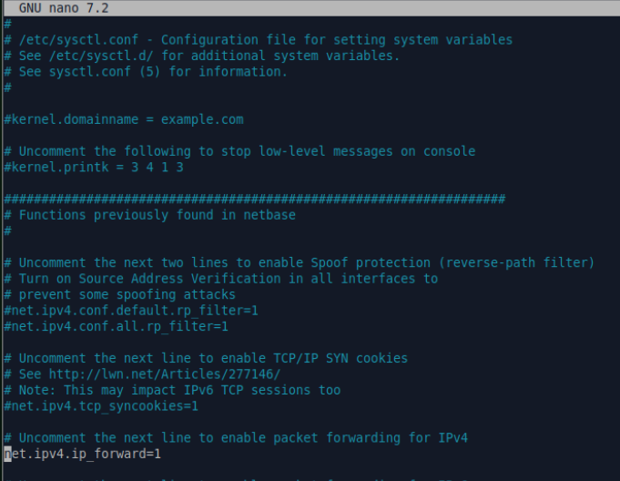

## Enrutamiento Ubuntu
Lo más importante de esta práctica es que entendáis bien el escenario que vais a montar, no continuéis hasta que no lo tengáis claro. Nuestro objetivo es que el Servidor Ubuntu que tiene dos interfaces de red haga de router y así los equipos que están en la red interna (cliente ubuntu y cliente windows) salgan a la red 192.168.2.0 y de ahí a internet a través del Servidor Ubuntu que enruta.

Este es el esquema de red con el que queremos trabajar


#### 1) El Servidor Ubuntu como veis tiene dos tarjetas de red (en virtualBox configurareis dos adaptadores de red)

Un adaptador está configurado en modo puente o sea que le pondréis una ip en la red que tenéis en casa (en mi caso en casa tengo la red 192.168.2.0/24, así que al adaptador de red que tengo en modo puente le he puesto la ip 192.168.2.2/24)

El otro adaptador lo tengo en "Red Interna" y lo configuro de forma estática con las siguientes características

- Dirección IP: 192.168.20.5

- Mascara de red: 255.255.255.0

#### 2) El cliente Ubuntu tiene una tarjeta de red, configurada en modo 'Red Interna' que debes configurar de forma estática o de forma dinámica si tienes activo el S.DHCP del server, en cualquier caso la configuración puede ser:

- IP: 192.168.20.20

- Máscara: 255.255.255.0

- Puerta de enlace: 192.168.20.5

- Dns: 192.168.20.5 si tienes tu servidor DNS funcionando ó  8.8.8.8 S.DNS gratuito de google o bien el DNS de tu proveedor de internet

#### 3) El cliente windows tiene una tarjeta de red, configurada en modo 'Red Interna' que debes configurar de forma estática o de forma dinámica si tienes activo el S.DHCP del server, en cualquier caso la configuración puede ser:

- IP: 192.168.20.21

- Máscara: 255.255.255.0

- Puerta de enlace: 192.168.20.5

 Dns: 192.168.20.5 si tienes tu servidor DNS funcionando ó 8.8.8.8 S.DNS gratuito de google o bien el DNS de tu proveedor de internet

**Antes de continuar comprobad que las dos redes os funcionan:**

• ping desde el servidor a un equipo cliente

• ping desde el servidor al router de salida hacia internet

• podéis salir a internet desde el servidor.

Si alguna de estas tres cosas no funciona no continuéis y comprobad bien las puertas de enlace, dns..

#### 4) Para terminar tenemos que hacer que el server tenga la función de router y haga NAT, para que todas las peticiones que vengan por la "red Interna" sean enrutadas por la tarjeta de red "Puente" y de esta manera los clientes sean capaz de salir a internet.

Para ello introduciremos en consola las siguientes ordenes:

```
#echo 1 > /proc/sys/net/ipv4/ip_forward
```

con esta orden damos el valor 1 a la variable ip_forward, habilitamos el enrutamiento, pero sólo lo hace de forma temporal, al apagar el equipo la variable ip_forward volverá a estar a 0. Podéis comprobar que la variable ha cogido el valor 1 haciendo:

```
#cat /proc/sys/net/ipv4/ip_forward
```

debería devolveros el valor 1.
Si queremos que los cambios sean permanentes:
editamos el archivo sysctl.conf

```
#nano /etc/sysctl.conf
```

buscamos #net.ipv4.ip_forward=1 y quitamos el # (lo descomentamos)  



y aplicamos los cambios

```
sudo sysctl -p
```

Hasta aquí hemos conseguido que haya comunicación entre las dos redes 192.168.2.0/24 y 192.168.20.0/24

#### 5) Ahora nos falta otro comando para habilitar el enmascaramiento de la ip cuando los paquetes salen hacia internet. Si no realizamos este paso los paquetes “de vuelta” de internet no podrían entrar a la red.

```
#iptables –t nat –A POSTROUTING –o enp2s0 –j MASQUERADE
```

donde enp2s0 es la interfaz de red de nuestro servidor ubuntu 192.168.2.2

Al ejecutar el comando: iptables -L -t nat se ve que se ha añadido la regla:

MASQUERADE all anywhere anywhere

#### 6) Debemos asegurarnos también de que el servidor permite el reenvio entre interfaces, lo haremos así:

```
sudo iptables -A FORWARD -i enp1s0 -o enp2s0 -j ACCEPT

sudo iptables -A FORWARD -i enp2s0 -o enp1s0 -m state --state RELATED,ESTABLISHED -j ACCEPT
```

siendo enp1s0 la tarjeta de red del servidor que está en red interna y enp2s0 la tarjeta de red del servidor que está en modo puente y da salida a internet

#### Diagnóstico

Desde el cliente:

- ¿Puedes hacer ping a la IP interna del servidor?

- ¿Puedes hacer ping a una IP pública (como 8.8.8.8)?

- ¿Puedes resolver dominios (como ping google.com)?

#### Solución resumida

Asegúrate de que:

- IP forwarding esté activo: sysctl -w net.ipv4.ip_forward=1

- NAT esté correctamente configurado (sin guiones largos):

iptables -t nat -A POSTROUTING -o enp2s0 -j MASQUERADE

- Se permitan los paquetes reenviados en iptables (reglas FORWARD)

- Cliente tenga bien configurada la IP, gateway y DNS

Si necesitas hacer la configuración persistente, puedes guardar las reglas de iptables con:

```
sudo iptables-save > /etc/iptables/rules.v4
 ```

(Instala iptables-persistent si no existe)
