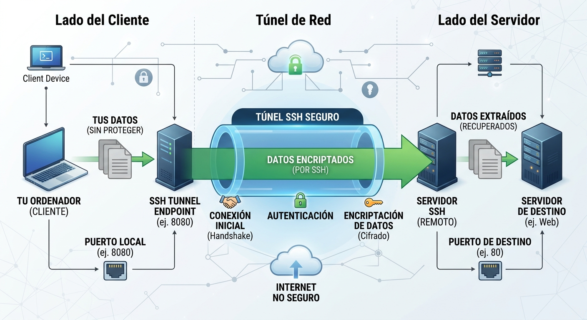

# Servicio de acceso y control remoto

## Índice

1. [Servicio SSH](#1-servicio-ssh)
2. [Funcionamiento de SSH](#2-funcionamiento-de-ssh)
   - [¿Qué es un túnel SSH?](#21-qué-es-un-túnel-ssh)
3. [Cliente SSH](#3-cliente-ssh)
   - [Transferencia segura de archivos](#31-transferencia-segura-de-archivos)
   - [Reenvío X11](#32-reenvío-x11)
   - [Reenvío por TCP/IP](#33-reenvío-por-tcpip)
4. [Servidor SSH](#4-servidor-ssh)
5. [Acceso remoto, control remoto y administración remota](#5-acceso-remoto-control-remoto-y-administración-remota)

---

## 1. Servicio SSH

Los servicios de acceso y control remoto permiten, mediante la utilización de determinadas aplicaciones de software, establecer conexiones con equipos a distancia y administrarlos de manera centralizada sin necesidad de acceder físicamente a ellos.

En el caso de disponer de equipos que no tienen teclado o pantalla, o de servidores instalados en un rack o que no están físicamente presentes, es importante contar con mecanismos que permitan administrarlos remotamente de forma cómoda, rápida y segura.

Esta función puede tener consecuencias impredecibles si no se lleva a cabo con unas condiciones de seguridad bien definidas. Cualquier vulnerabilidad que presenten estas herramientas puede permitir el acceso de terceros no autorizados a información confidencial.

Las tecnologías de acceso y administración remota pueden trabajar en modo texto o en modo gráfico. En modo texto, **SSH (Secure Shell)** es una de las tecnologías fundamentales para la administración remota de sistemas. En modo gráfico existen soluciones como **VNC** y **Escritorio remoto de Windows (RDP)**.

**SSH** es un protocolo utilizado para establecer conexiones seguras entre máquinas remotas. Su especificación principal está documentada en el RFC 4251.

### Principales características de SSH

- Utiliza normalmente el **puerto 22/TCP** y sigue el modelo cliente-servidor.
- Permite la autenticación de los usuarios mediante contraseña o mediante **claves criptográficas**.
- Puede integrarse con otros mecanismos de autenticación y gestión de identidad, como **PAM**.
- Está implementado para una gran variedad de sistemas operativos y plataformas.

### Ventajas de utilizar SSH

- Después de la primera conexión, el cliente puede reconocer al servidor en futuras sesiones mediante las claves de host almacenadas.
- La información necesaria para la autenticación viaja protegida por el canal cifrado.
- Los datos enviados y recibidos durante la sesión se transmiten cifrados.
- Permite ejecutar órdenes y determinadas aplicaciones de forma remota y segura.
- Permite realizar transferencias de archivos mediante herramientas como `sftp` y `scp`.

Con la utilización de SSH se pretende evitar:

1. La **interceptación de la comunicación** entre dos sistemas por parte de una tercera máquina que copie la información que circula entre ellos y pueda intentar modificarla.
2. La **suplantación del servidor** mediante ataques de tipo *man in the middle*.

La verificación de las claves de host es una parte fundamental de la seguridad de SSH.

---

## 2. Funcionamiento de SSH

Las claves de una correcta conexión remota son:

- No transmitir las contraseñas en texto plano por la red.
- Utilizar un proceso de autenticación con garantías.
- Ejecutar de forma segura órdenes remotas y realizar transferencias de archivos.
- Utilizar, cuando sea necesario, mecanismos de reenvío como X11 o TCP/IP a través del canal SSH.

El establecimiento de una conexión SSH implica, de forma simplificada:

1. La máquina cliente abre una conexión **TCP** con el servidor SSH, normalmente sobre el puerto 22.
2. Cliente y servidor negocian los algoritmos y parámetros criptográficos que utilizarán.
3. El servidor dispone de una **clave de host**, formada por una clave pública y una clave privada.
4. El cliente recibe la clave pública o su huella y comprueba si coincide con la que conoce.
5. En una primera conexión, el usuario debe verificar la identidad del servidor. Aceptar una clave sin comprobarla puede facilitar un ataque *man in the middle*.
6. Cliente y servidor establecen las claves necesarias para proteger la sesión.
7. Se autentica al usuario, por ejemplo mediante contraseña o mediante claves públicas.
8. Se inicia la sesión remota.


### Verificación de la identidad del servidor

La primera conexión merece especial atención. Si el cliente acepta sin comprobar una clave de host falsa, un atacante situado entre cliente y servidor podría intentar hacerse pasar por el servidor legítimo.

En una red administrada se pueden distribuir previamente las huellas o claves de los servidores para que los usuarios puedan verificarlas antes de aceptar una conexión.

---

## 2.1. ¿Qué es un túnel SSH?

SSH permite crear un **canal seguro** y utilizarlo para transportar determinadas comunicaciones mediante técnicas de **reenvío de puertos (*port forwarding*)**.

El procedimiento consiste en crear un túnel por el que viajen los datos de manera segura. SSH recibe los datos en un extremo y los reenvía por el canal seguro hacia el otro extremo.

  

El reenvío de puertos puede ser interesante para:

- Acceder a servicios TCP internos de una LAN con direcciones privadas.
- Proteger mediante SSH el acceso a servicios que no dispongan de cifrado propio.
- Acceder a determinados servicios internos a través de una máquina que permita conexiones SSH.
- Disponer de determinados servicios a través de una red no confiable.

---

## 3. Cliente SSH

El cliente SSH es la herramienta de software que permite al usuario, desde una máquina local, solicitar el establecimiento de una conexión segura con un servidor SSH remoto.

La conexión SSH se puede llevar a cabo mediante herramientas gráficas o desde una consola en modo línea de comandos.

En sistemas GNU/Linux, la herramienta habitual es `ssh`. También existen clientes para Windows, como PuTTY.

La sintaxis básica es:

```bash
ssh [usuario@]host
```

Donde:

- `usuario` es el nombre de usuario con el que se desea iniciar sesión.
- `host` es la dirección IP o el nombre DNS de la máquina que ejecuta el servidor SSH.

Ejemplo:

```bash
ssh alumno@192.168.20.10
```

---

## 3.1. Transferencia segura de archivos

### La orden `scp`

`scp` permite realizar transferencias de archivos entre máquinas utilizando SSH.

Su funcionamiento es similar al comando `cp`, pero permite copiar archivos entre sistemas remotos.

Ejemplo:

```bash
scp archivo.txt alumno@192.168.20.10:/home/alumno/
```

Para copiar un archivo desde el servidor remoto al equipo local:

```bash
scp alumno@192.168.20.10:/home/alumno/archivo.txt .
```

También permite trabajar con directorios utilizando la opción `-r`:

```bash
scp -r carpeta/ alumno@192.168.20.10:/home/alumno/
```

### La orden `sftp`

`SFTP` permite abrir una sesión interactiva de transferencia de archivos sobre SSH.

Ejemplo:

```bash
sftp alumno@192.168.20.10
```

Una vez establecida la conexión se pueden utilizar comandos propios de SFTP.

Algunos comandos habituales son:

```text
help       Mostrar ayuda
ls         Listar archivos remotos
pwd        Mostrar el directorio remoto actual
cd         Cambiar de directorio remoto
get        Descargar archivos
put        Subir archivos
lcd        Cambiar el directorio local
lpwd       Mostrar el directorio local
exit       Salir
```

Por ejemplo:

```text
sftp> ls
sftp> get documento.pdf
sftp> put practica.txt
```

---

## 3.2. Reenvío X11

Una de las funciones de SSH es establecer una línea de órdenes segura. En sistemas GNU/Linux también puede utilizarse SSH para reenviar aplicaciones gráficas basadas en X11.

El reenvío X11 permite utilizar el canal SSH para transportar de forma segura el tráfico X11 entre el cliente y el servidor.

El funcionamiento conceptual es:

1. Se establece la conexión con el servidor remoto mediante SSH.
2. SSH crea y gestiona el canal de reenvío X11.
3. La aplicación gráfica se ejecuta en la máquina remota.
4. La interfaz gráfica se muestra en la máquina local a través del canal SSH.


Una forma de ejecutar una aplicación gráfica remota es:

```bash
ssh -X usuario@maquina_remota xterm
```

También puede utilizarse `-Y` en determinados escenarios en los que se necesita un reenvío X11 de confianza:

```bash
ssh -Y usuario@maquina_remota xterm
```

> **Nota:** X11 forwarding sigue existiendo, pero es una tecnología especializada. Para una práctica de SMR puede ser útil como ejemplo de reenvío a través de SSH.

---

## 3.3. Reenvío por TCP/IP

SSH permite reenviar conexiones TCP mediante un canal cifrado.

Un ejemplo es:

```bash
ssh -L 10143:localhost:143 alumno@mail.servidor.aula
```

La opción `-L` crea un **reenvío local**.

En este ejemplo:

- `10143` es el puerto local.
- `localhost:143` identifica el destino visto desde el servidor SSH.
- `alumno@mail.servidor.aula` indica el usuario y el servidor SSH al que se conecta el cliente.

Una vez establecido el túnel, una aplicación que se conecte al puerto local `10143` puede enviar su tráfico a través del canal SSH hasta el puerto 143 del destino.

Esquema conceptual:

```text
Cliente
  |
  | conexión al puerto 10143
  v
SSH local =================== SSH ===================> Servidor
                                                          |
                                                          | puerto 143
                                                          v
                                                       Servicio
```

El reenvío TCP también puede utilizarse para acceder a servicios internos que no son directamente accesibles desde la máquina cliente.

### Desactivar el reenvío de puertos

Si el administrador no quiere permitir el reenvío de puertos, puede configurarlo en el servidor SSH mediante `sshd_config`.

Por ejemplo:

```text
AllowTcpForwarding no
```

Después de modificar la configuración se debe comprobar y recargar o reiniciar el servicio SSH según el sistema utilizado.

En sistemas actuales conviene comprobar la configuración efectiva antes de reiniciar:

```bash
sudo sshd -t
```

---

## 4. Servidor SSH

El servidor SSH facilita el establecimiento de conexiones remotas que permiten:

- Iniciar sesiones de usuario.
- Ejecutar órdenes remotamente.
- Transferir archivos.
- Administrar sistemas.
- Utilizar reenvío de puertos.
- Utilizar otros mecanismos proporcionados por SSH.

Una implementación libre muy utilizada es **OpenSSH**.

### OpenSSH

OpenSSH es un conjunto de herramientas que proporciona implementaciones de cliente y servidor SSH y herramientas relacionadas.

Entre sus características se encuentran:

1. Es software de código abierto.
2. Está disponible para GNU/Linux, BSD, macOS, Windows y otros sistemas.
3. Proporciona cliente y servidor SSH.
4. Incluye herramientas como `scp` y `sftp`.
5. Permite realizar reenvío de puertos.
6. Permite utilizar autenticación mediante claves.
7. Puede utilizar compresión.
8. Incluye mecanismos de reenvío de agente y otras funciones.

---

## 5. Acceso remoto, control remoto y administración remota

Existe cierta confusión entre los términos utilizados para describir las distintas formas de trabajar con equipos remotos. Una misma herramienta puede reunir varias de estas funciones.

### Acceso remoto

El acceso remoto permite acceder desde un equipo local a recursos o a una sesión de trabajo de un equipo remoto.

En Windows se utiliza **Escritorio remoto**, basado en el protocolo **RDP**.

En GNU/Linux existen diferentes soluciones de escritorio remoto, dependiendo de las necesidades del entorno.

### Control remoto

El control remoto implica acceder a un equipo remoto y manejarlo como si se estuviera delante de él.

Por ejemplo, mediante:

- **VNC (Virtual Network Computing)**.
- Otras herramientas de asistencia y soporte remoto.

VNC permite visualizar el escritorio de un equipo remoto y controlarlo mediante el teclado y el ratón.

### Administración remota

La administración remota consiste en utilizar herramientas software que permitan realizar a distancia tareas de administración sobre equipos cliente, servidores y aplicaciones.

Podemos encontrar diferentes tipos de soluciones:

- Herramientas que utilizan un programa cliente para establecer la conexión con el equipo remoto.
- Herramientas que proporcionan una interfaz web para administrar el sistema.

Una solución de administración mediante interfaz web es **Webmin**.

